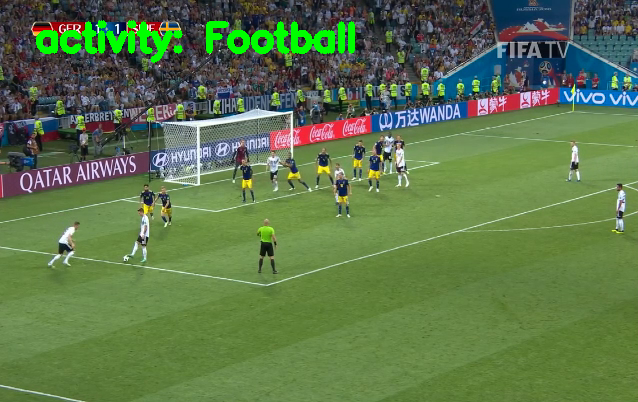
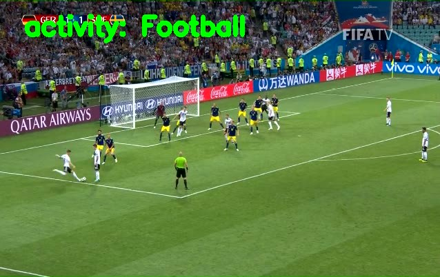
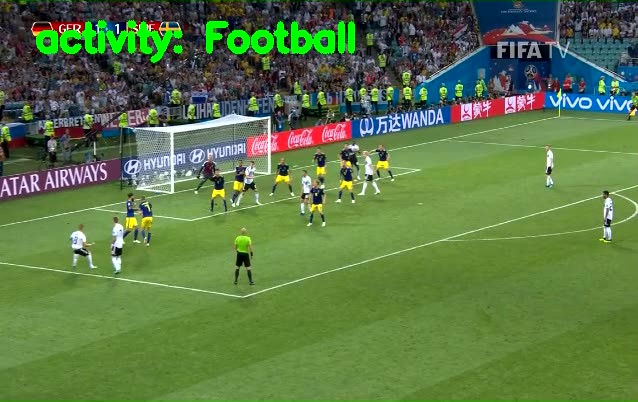
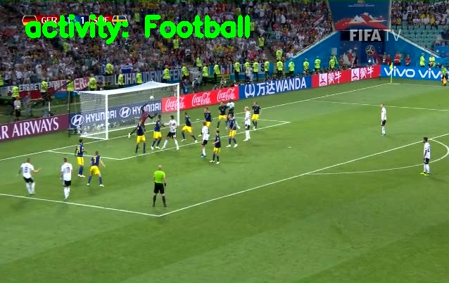
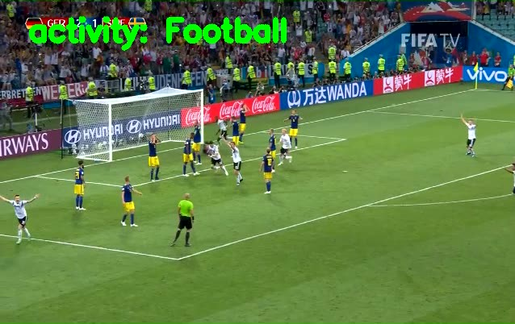

## Video-based-Sports-Classification

Developed an Convolutional Neural Network for Video-based Sports-Detection in real time. Used OpenCV and Keras for training alongside transfer learning with fine tuning. There were 3 categories of Sports- **Football** , **Weight Lifting** and **Tennis**.
Achieved a **89.97%** accuracy on the training images and an **90.29%** accuracy on the test videos

## Results

---

---

---

---

---

---
